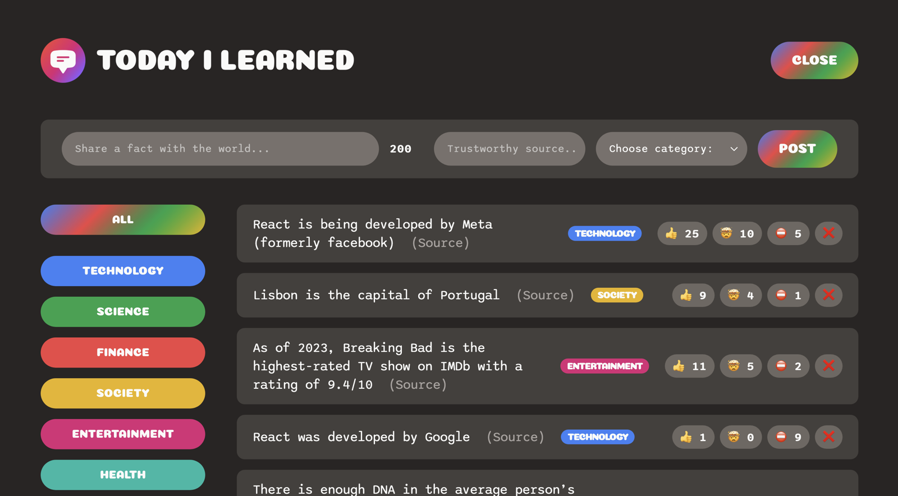

# Today I Learned

A fun and interactive platform for sharing and discovering interesting facts. Users can share facts, categorize them, and vote on their validity and impact. Think of it as a "Reddit for Facts" where knowledge meets social interaction.



## 🚀 Features

- Share interesting facts with sources
- Categorize facts by topic
- Vote system (Interesting, Mindblowing, False)
- Real-time updates
- Category filtering
- Character limit for concise facts
- Source URL validation
- Responsive design

## 💻 Tech Stack

- **Frontend Framework:** React + Vite
- **Database:** Supabase (PostgreSQL)
- **State Management:** React Hooks + Custom Hooks
- **Styling:** CSS3 with modern features
- **Deployment:** Netlify

## 🏗️ Project Structure

```
src/
├── components/
│   ├── facts/          # Fact-related components
│   ├── layout/         # Structural components
│   └── ui/            # Shared UI components
├── hooks/             # Custom React hooks
├── services/          # API and database services
├── utils/             # Constants and helpers
└── style.css         # Global styles
```

## 🌟 Architecture Highlights

- **Component-Driven Development:** Modular, reusable components
- **Custom Hooks Pattern:** Centralized state management with `useFactOperations`
- **Service Layer:** Abstracted database operations in `factService`
- **Clean Code:** Organized imports, consistent styling, and clear component hierarchy

## 🛠️ Getting Started

1. Clone the repository

   ```bash
   git clone [your-repo-url]
   ```

2. Install dependencies

   ```bash
   npm install
   ```

3. Set up environment variables

   ```bash
   cp .env.example .env
   # Add your Supabase credentials
   ```

4. Start the development server
   ```bash
   npm run dev
   ```

## 🗺️ Roadmap

### Phase 1: Authentication & User Management

- [ ] Supabase Auth integration
- [ ] User profiles
- [ ] Fact ownership
- [ ] User reputation system
- [ ] Protected actions (delete/edit)

### Phase 2: Enhanced Fact Validation

- [ ] Fact verification system
- [ ] Trusted fact checkers
- [ ] Source validation
- [ ] Advanced categorization with tags
- [ ] Rich text support

### Phase 3: Social Features

- [ ] Comments on facts
- [ ] Social sharing
- [ ] User following
- [ ] Category following
- [ ] Notification system

### Phase 4: UX Improvements

- [ ] Infinite scroll
- [ ] Advanced search/filtering
- [ ] Multiple sort options
- [ ] Smooth animations
- [ ] Dark mode
- [ ] Mobile optimizations

### Phase 5: Performance & Scale

- [ ] React Query integration
- [ ] Optimistic updates
- [ ] Pagination/virtualization
- [ ] Offline support
- [ ] Analytics integration

### Phase 6: Learning Features

- [ ] Daily fact suggestions
- [ ] Learning streaks
- [ ] Quiz mode
- [ ] Spaced repetition
- [ ] Flashcard export

### Phase 7: AI Integration

- [ ] Fact suggestions
- [ ] Duplicate detection
- [ ] Auto-categorization
- [ ] Related facts
- [ ] Content moderation

## 🙏 Acknowledgments

- Original concept by [Jonas Schmedtmann](https://jonas.io/) - demonstrating how to build a full-stack app in under a week
- Built with React, Vite, and Supabase
- Enhanced with custom hooks pattern and component-driven architecture
- Special thanks to the React and Supabase communities
